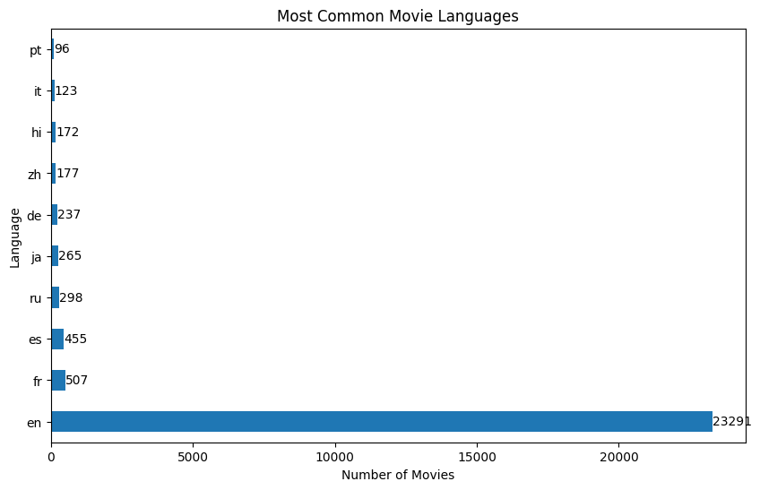

# Project Description

## Project Overview

This document serves as a guide to the analysis performed on movie data sourced from various sources, focusing on key business questions related to language prevalence, budget's impact on revenue, the relationship between average vote and popularity, and the influence of movie language on its popularity.

### Business Understanding

The purpose of this analysis is to answer questions that can help Microsoft in the entertainment industry make informed choices. We are looking into things like which languages are most commonly used in movies, whether spending more money on a movie leads to higher profits, if people's votes for movies reflect the actual popilarity of the movie, and whether the language a movie is in affects how popular it becomes. By understanding these factors, we can figure out how to make better movies and market them more effectively

### Data Analysis and understanding

The data used and analysed has been sourced from various reputable websites such as:

* [Box Office Mojo](https://www.boxofficemojo.com/)
* [IMDB](https://www.imdb.com/)
* [Rotten Tomatoes](https://www.rottentomatoes.com/)
* [TheMovieDB](https://www.themoviedb.org/)
* [The Numbers](https://www.the-numbers.com/)

### Description of Data
The datasets used contain information on thousands of movies, including details such as release year, language, budget, revenue, average vote, and popularity. We approached the analysis of the data using the following questions:

* What is the most common language that movies are watched in?
* Does language Affect Popularity?
* Does average vote affect Popularity?
* Does budget affect revenue?

Using these questions, the datasets were cleaned and merged to facilitate the analysis process.
After analysis, there were several observations in regards to our iniital questions

**The most common language.**

-  

This shows the most common language that most movies are available in and 9 others, but there are more in the code section

**Correlation between language and popularity.**

  

**Effect of budget on worldwide revenue.**

  

**Vote average and Popularity**

## Findings and conclusion

Findings:

**Language Prevalence** - English emerges as the predominant language in movies, indicating its widespread adoption and appeal in global cinema.

**Budget and Revenue Relationship** -  Our analysis reveals a positive correlation between movie budgets and revenue on a global scale. This suggests that higher investments in movie production tend to yield increased financial returns, but a high budget will not always result in a successful movie as there are factors such as marketing fees and distribution

**Average Vote and Popularity** - While there is a correlation between the average vote received by a movie and its popularity, it's important to note that this relationship may not always hold true. Some movies have higher average votes but may not necessarily translate into broader popularity among audiences.

**Impact of Movie Language on Popularity** - Contrary to common assumptions, our analysis indicates that the language of a movie may not significantly impact its popularity among viewers. Despite Endlish being dominant, other languages that rankes lower in the availability still have levels of popularity in respact to their availability

In conclusion, by taking the analysed questions and factors into making, marketing and distributing movies, Microsoft can make good strides into penetrating the movie market
